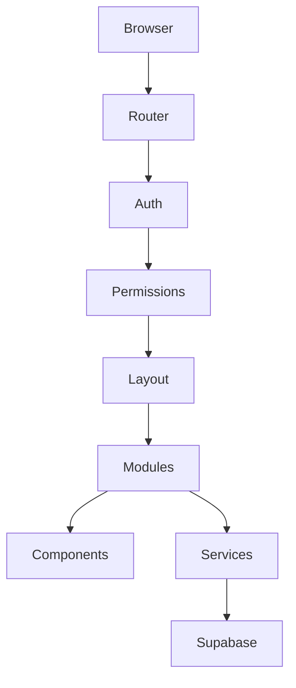

# Arquitetura Técnica do Purple Gestão Next

**Status:** Proposta para aprovação  
**Objetivo:** reconstruir o frontend com uma base moderna, modular e durável, preservando integralmente o backend atual.

## 1. Diretriz de produto

O Purple Gestão Next deve ser tratado como uma plataforma, não apenas como um sistema interno.

Isso significa que a base técnica precisa suportar, sem reescrita estrutural:

- PurpleHub para alunos e professores;
- aplicativo móvel;
- integrações com IA;
- APIs externas;
- novos módulos de negócio;
- evolução contínua por anos.

A regra principal é simples: o frontend novo pode mudar por completo, mas o backend preservado continua sendo a fonte de verdade.

---

## 2. Stack tecnológica recomendada

### 2.1 Escolha principal

| Camada | Tecnologia | Motivo |
|---|---|---|
| Framework | React 19 | ecossistema maduro, longo ciclo de vida, ampla adoção e ótimo encaixe para plataformas ricas em formulários, tabelas e estados. |
| Build tool | Vite | inicialização rápida, configuração simples, build eficiente e excelente para apps estáticos publicados na Vercel. |
| Linguagem | TypeScript | reduz erros estruturais, melhora manutenção em longo prazo e facilita compartilhamento de contratos com futuras integrações. |
| Router | TanStack Router | rotas tipadas, guards explícitos, bom encaixe para autorização, carregamento por rota e crescimento modular. |
| Estado global | Zustand | leve, previsível e suficiente para sessão, UI, preferências e estados globais sem complexidade desnecessária. |
| Estado de servidor | TanStack Query | cache, revalidação, estados de loading/erro e sincronização com Supabase com controle fino. |
| Formulários | React Hook Form + Zod | formulários rápidos, validação declarativa e contratos claros de entrada/saída. |
| Tabelas | TanStack Table | adequado para relatórios, filtros, paginação, ordenação e grids corporativos complexos. |
| Componentes UI | Radix UI + design system próprio | acessibilidade e primitives sólidas, com liberdade visual total para a identidade Purple. |
| Estilização | Tailwind CSS + tokens de design | velocidade de implementação e consistência visual com tokens centralizados. |
| Ícones | Lucide React | biblioteca ampla, leve e consistente com aplicações corporativas. |
| Datas | date-fns | utilitários confiáveis para datas, períodos e formatação local. |
| Logs | logger centralizado próprio | separa ambiente dev/prod e permite evoluir para observabilidade externa sem refatoração. |
| Testes unitários | Vitest | alinhado ao ecossistema Vite/React e rápido para regressão contínua. |
| Testes de componente | Testing Library | valida comportamento real da interface, não implementação. |
| E2E | Playwright | essencial para login, sessão, permissões e fluxos críticos. |
| Qualidade de código | ESLint + Prettier + TypeScript strict | consistência, legibilidade e prevenção de regressões. |

### 2.2 Por que não reutilizar a arquitetura atual

O frontend legado cumpriu o papel de protótipo funcional e produto em operação inicial, mas hoje ele concentra:

- bootstrap monolítico;
- acoplamento alto entre auth, estado e módulos;
- dependência de variáveis globais;
- manutenção difícil;
- riscos de regressão no login e no carregamento.

O Purple Gestão Next deve corrigir isso na estrutura, não por remendos.

---

## 3. Arquitetura em camadas



### 3.1 Browser

Camada de execução. Responsável apenas por carregar a aplicação, armazenar sessão conforme a política definida e exibir a interface.

### 3.2 Router

Responsável por:

- definir rotas públicas e privadas;
- bloquear navegação sem sessão;
- carregar módulos sob demanda;
- manter o estado da rota atual;
- aplicar guards por papel e escopo.

### 3.3 Auth

Responsável por:

- inicialização do cliente Supabase;
- login;
- logout;
- restauração de sessão;
- refresh de token;
- tratamento de falhas de autenticação;
- emissão do estado de sessão para a aplicação.

### 3.4 Permissions

Responsável por:

- carregar perfil e permissões do usuário;
- derivar o conjunto efetivo de acessos;
- proteger rotas;
- proteger ações de interface;
- validar escopo de setor/unidade/organização.

### 3.5 Layout

Responsável por:

- shell geral da aplicação;
- sidebar;
- topbar;
- área de conteúdo;
- estados de loading, vazio e erro;
- responsividade.

### 3.6 Modules

Cada módulo é uma unidade de negócio independente:

- Dashboard
- Pedagógico
- Financeiro
- Relatórios
- Inventário
- Purple Intelligence
- Configurações
- Usuários
- demais módulos futuros

Cada módulo decide sua própria apresentação, mas obedece aos contratos comuns de auth, permissões e serviços.

### 3.7 Components

Responsáveis por primitives compartilhadas:

- botões;
- inputs;
- modais;
- tabelas;
- cards;
- banners;
- skeletons;
- toasts;
- filtros;
- badges;
- empty states.

### 3.8 Services

Responsáveis por:

- conversar com Supabase;
- mapear DTOs;
- encapsular regras de acesso a dados;
- validar respostas;
- isolar detalhes de infraestrutura.

### 3.9 Supabase

Fonte de verdade do backend:

- Auth;
- banco PostgreSQL;
- RLS;
- Edge Functions;
- buckets;
- views;
- RPCs.

O frontend nunca substitui essas regras.

---

## 4. Estrutura de diretórios proposta

```text
src/
  app/
    bootstrap/
    providers/
    router/
    layout/
    config/
  auth/
    authService.ts
    session.ts
    permissions.ts
    login.tsx
    logout.ts
    guards.ts
  modules/
    dashboard/
      pages/
      components/
      services/
      hooks/
      types.ts
    pedagogico/
    financeiro/
    relatorios/
    inventario/
    intelligence/
    settings/
    users/
  components/
    ui/
    forms/
    tables/
    charts/
    modals/
    feedback/
  services/
    supabase/
    logger/
    errors/
    storage/
    analytics/
  hooks/
  utils/
  types/
  styles/
  assets/
  tests/
public/
```

### 4.1 Intenção dessa estrutura

- `app/` concentra bootstrap, router e layout raiz.
- `auth/` concentra tudo que é sessão, login e autorização.
- `modules/` organiza a regra de negócio por domínio.
- `components/` concentra elementos reutilizáveis.
- `services/` isola acesso ao backend e infraestrutura.
- `types/` centraliza contratos.
- `utils/` mantém helpers puros e pequenos.

---

## 5. Estratégia de autenticação

### 5.1 Fluxo principal

1. Carregar aplicação.
2. Validar ambiente.
3. Criar cliente Supabase.
4. Restaurar sessão existente.
5. Validar token.
6. Buscar usuário autenticado.
7. Buscar perfil.
8. Buscar permissões.
9. Criar estado global.
10. Renderizar Dashboard.

### 5.2 Regras de implementação

- O cliente Supabase será um singleton.
- O estado de sessão ficará em um store dedicado.
- O router não deve renderizar páginas privadas sem sessão validada.
- Qualquer falha deve mostrar interface de erro amigável, nunca tela branca.
- O login deve impedir múltiplos cliques, exibir loading e tratar erro com mensagem clara.
- O logout deve limpar estado e retornar ao login.
- O refresh deve restaurar a sessão automaticamente.

### 5.3 Tratamento de erros

Camadas de erro obrigatórias:

- validação de ambiente;
- criação do client;
- autenticação;
- restauração de sessão;
- busca de profile;
- busca de permissões;
- carregamento de módulo;
- erro de rede;
- erro de política/RLS;
- erro inesperado de runtime.

Cada erro deve:

- ser registrado no logger;
- exibir mensagem amigável;
- preservar o estado possível;
- permitir recuperação sem recarregar o projeto inteiro.

### 5.4 Segurança

- `SUPABASE_SERVICE_ROLE_KEY` nunca entra no frontend.
- O frontend usa somente a chave pública adequada ao navegador.
- O backend continua sendo o responsável final por autenticação e autorização.

---

## 6. Estratégia de permissões

### 6.1 Princípio

Permissão no frontend é experiência; permissão no backend é verdade.

O frontend deve:

- esconder rotas e ações indevidas;
- evitar navegação sem acesso;
- evitar botões indevidos;
- apresentar feedback claro quando houver bloqueio.

O backend deve:

- validar sessão;
- validar papel;
- validar escopo;
- validar propriedade;
- validar RLS.

### 6.2 Carregamento de permissões

Após o login:

1. buscar `profiles`;
2. ler `role`, `sector`, `access_scope`, `permissions`, `active`;
3. derivar permissões efetivas;
4. armazenar snapshot de autorização;
5. usar esse snapshot para router, layout e módulos.

### 6.3 Proteção de rotas

Cada rota terá:

- requisito de sessão;
- requisito de papel;
- requisito de permissão;
- requisito de escopo.

Se falhar:

- redirecionar para a rota segura;
- exibir aviso amigável;
- registrar o bloqueio.

### 6.4 Proteção de ações

Mesmo com a rota aberta:

- botões de criar, editar, excluir, exportar e aprovar devem verificar permissão;
- o service layer também valida a operação;
- a API/edge function continua validando no servidor.

---

## 7. Estratégia de componentes

### 7.1 Componentes globais

- AppShell
- Sidebar
- Topbar
- NotificationsCenter
- GlobalLoader
- GlobalErrorBoundary
- GlobalToasts
- GlobalModalHost

### 7.2 Componentes reutilizáveis

- Button
- Input
- Select
- Textarea
- Checkbox
- Switch
- Badge
- Card
- Panel
- EmptyState
- Skeleton
- Tabs
- Drawer
- Modal
- Table
- FilterBar
- DateRangePicker
- SearchInput
- Pagination
- StatCard
- ChartCard

### 7.3 Componentes de domínio

Cada módulo terá seus próprios componentes de composição:

- ReportEditor
- ReportHistoryTable
- OperationalDiaryForm
- InventoryMovementForm
- UserAdminModal
- ActionPlanCard
- IntelligenceSummary

### 7.4 Páginas

Páginas devem ser finas.

Elas devem:

- ler rota;
- buscar dados via service;
- compor componentes;
- não concentrar regra pesada.

### 7.5 Modais e formulários

Regras:

- formulário com React Hook Form;
- validação com Zod;
- estado de loading nativo;
- confirmação obrigatória para ações destrutivas;
- foco acessível;
- fechamento previsível.

### 7.6 Tabelas

Tabelas devem suportar:

- ordenação;
- filtro;
- paginação;
- busca;
- linhas vazias;
- loading;
- estados de erro;
- exportação.

---

## 8. Estratégia de migração

### 8.1 Princípio

Migrar sem quebrar produção.

O backend continua operando durante toda a migração.

### 8.2 Modo de migração

Recomendação:

- construir o Next em paralelo ao legado;
- publicar em preview;
- validar com dados reais;
- só promover para produção após aceitar a fase;
- manter rollback simples para o frontend anterior.

### 8.3 Ordem de migração

1. Shell, auth e layout.
2. Dashboard.
3. Pedagógico.
4. Financeiro.
5. Relatórios.
6. Inventário.
7. Purple Intelligence.
8. Configurações.
9. Usuários.
10. Demais módulos.

### 8.4 Critério por módulo

Cada módulo só é concluído quando:

- interface existe;
- permissões funcionam;
- leitura e gravação funcionam;
- estados vazios e erros estão tratados;
- comportamento antigo foi preservado;
- testes focais passaram;
- produção foi validada.

---

## 9. Roadmap de entregas publicáveis

### Entrega 1 — Base da aplicação

- bootstrap novo;
- layout novo;
- autenticação nova;
- sessão persistente;
- logout;
- rota privada protegida.

### Entrega 2 — Dashboard

- shell autenticado;
- painel básico;
- carregamento de perfil;
- permissões mínimas;
- cards iniciais.

### Entrega 3 — Relatórios

- listagem;
- criação;
- edição;
- envio;
- aprovação;
- ajuste;
- histórico.

### Entrega 4 — Diário Operacional e indicadores

- formulário por setor;
- snapshots consolidados;
- dashboard consumindo indicadores;
- alertas.

### Entrega 5 — Inventário

- livros;
- patrimônio;
- movimentações;
- histórico.

### Entrega 6 — Usuários, configurações e auditoria

- gerenciamento administrativo;
- perfil;
- segurança;
- parâmetros;
- feed/histórico.

### Entrega 7 — Consolidação

- revisão de UX;
- performance;
- acessibilidade;
- testes e estabilidade;
- corte definitivo do legado.

---

## 10. Estratégia de testes

### 10.1 Testes unitários

- validações;
- utilitários;
- permissões;
- formatação;
- mapeamentos;
- guards.

### 10.2 Testes de componente

- formulários;
- tabelas;
- modais;
- estados vazios;
- loading;
- erros.

### 10.3 Testes de integração

- login;
- logout;
- sessão;
- perfis;
- permissões;
- leitura de dados;
- gravação de dados;
- navegação protegida.

### 10.4 Testes end-to-end

- login real;
- refresh;
- token expirado;
- bloqueio por permissão;
- fluxo de relatório;
- fluxo de inventário;
- fluxo de usuários;
- fluxo de aprovação.

---

## 11. Observabilidade e logs

### 11.1 Objetivo

Saber rapidamente:

- o que falhou;
- em qual camada;
- em qual módulo;
- para qual perfil;
- com qual contexto.

### 11.2 Regras

- Logger central com níveis.
- Erros tratáveis não devem quebrar a app inteira.
- Em produção, logs devem ser úteis e curtos.
- Em desenvolvimento, logs devem ser detalhados.

### 11.3 Métricas futuras

A arquitetura já deve permitir:

- telemetria de sessão;
- métricas de uso por módulo;
- captura de exceções;
- monitoramento de performance;
- auditoria de fluxo crítico.

---

## 12. Gestão de ambiente

### 12.1 Variáveis de ambiente

O frontend deve ler variáveis por ambiente e validar na inicialização.

Exemplos:

- `VITE_SUPABASE_URL`
- `VITE_SUPABASE_ANON_KEY`
- `VITE_APP_ENV`
- `VITE_APP_VERSION`

### 12.2 Regras

- sem segredo sensível no frontend;
- configuração validada antes do bootstrap;
- ambiente de produção explícito;
- preview e desenvolvimento separados;
- chaves e URLs nunca hardcoded no código final.

---

## 13. Justificativa da arquitetura escolhida

Essa arquitetura foi escolhida porque:

- escala bem com muitos módulos;
- reduz o risco de regressão;
- separa bem responsabilidade;
- facilita testes;
- conversa bem com Supabase;
- combina com Vercel;
- permite futuro mobile e PurpleHub;
- não prende a plataforma em um frontend monolítico frágil;
- mantém a base evolutiva por vários anos.

---

## 14. Resultado esperado após aprovação

Depois de aprovada esta arquitetura:

- o desenvolvimento do Purple Gestão Next pode começar;
- a Fase 1 inicia pelo shell + auth + dashboard;
- nenhum módulo adicional será iniciado antes da fase-base estar validada em produção.

---

## 15. Decisão pendente para aprovação

Se a proposta for aprovada, o próximo passo é iniciar a Fase 1 com:

- bootstrap novo;
- autenticação nova;
- layout base;
- Dashboard básico;
- sem tocar no backend.

